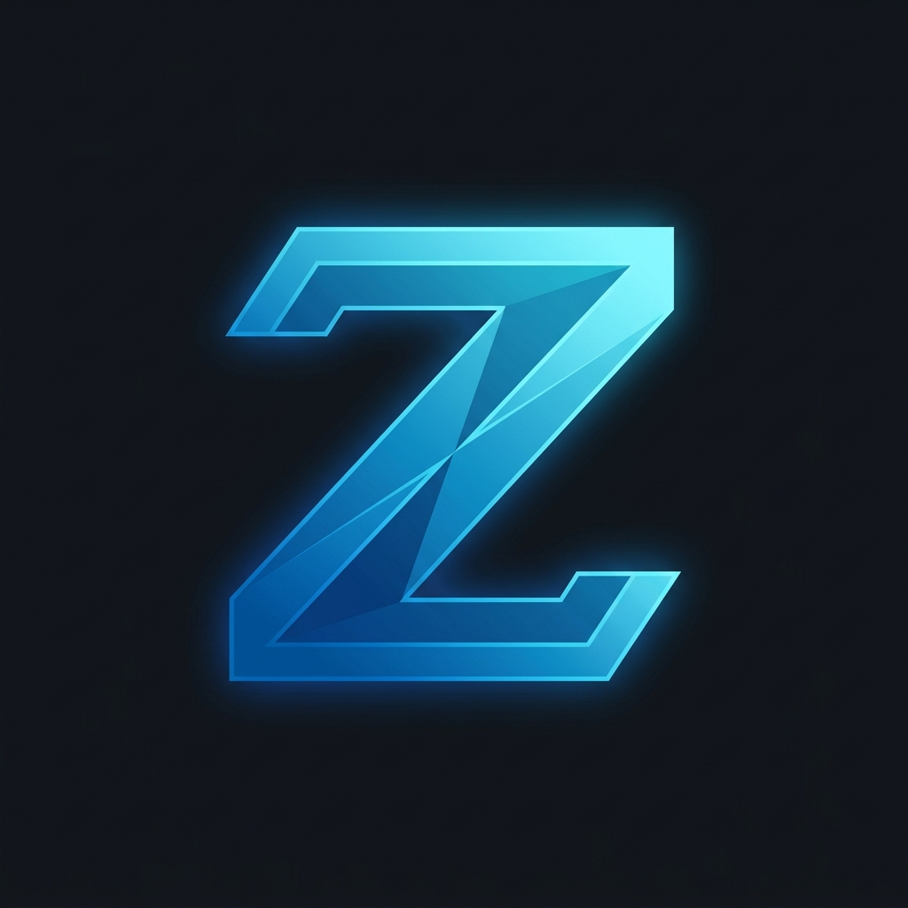

  

  # Zodex
  **The ultimate, secure, and modern Roblox Account Manager.**
  
  🌍 **[Official Website - Buy License Key](https://zodex.best)**

---

## ⚡ Features
- **Multi-Account Support:** Add and manage all your Roblox accounts in one place.
- **Multi-Instance:** Run multiple instances of Roblox at the exact same time without needing any extra tools.
- **Instant Launching:** Launch Roblox normally, or paste a Game Link to jump straight into a specific game.
- **Custom Launchers:** Built-in support for Bloxstrap, Fishstrap, Voidstrap, and default Roblox.
- **Beautiful UI:** A fancy, highly polished, and beautiful user interface.
- **Secure:** Your data stays local. Zodex securely handles your sessions.

## 📥 How to Install
1. Go to the **[Releases](../../releases)** page.
2. Download the latest `Zodex Setup.exe`.
3. Run the installer and you're good to go!

## 🔄 Updating
Zodex comes with a built-in auto-updater. Whenever a new version is released here on GitHub, the app will automatically notify you and download the latest update, ensuring you never miss out on new features!

---

  <i>Created by Ziadod</i>

